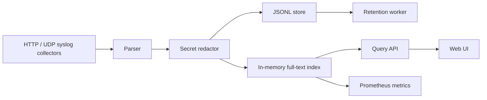

# Architecture

`loglite` implements the Notion pipeline:

## Storage

The durable store is append-only JSONL. On startup, `loglite` replays the file into an in-memory index. Retention rewrites the JSONL file only after removing expired entries.

This keeps the MVP small and inspectable while preserving the main infrastructure tradeoff: simple durability plus fast in-process search for compact deployments.

## Query Model

The query API supports:

- full-text terms over message, level, source, labels, and fields
- `level` filter
- repeated `label=key=value` filters
- `since` duration filters such as `15m`, `1h`, or `24h`
- bounded `limit`

## Redaction

Redaction runs before storage. It masks common secret shapes and suspicious field keys:

- `password=...`
- `token=...`
- `api_key=...`
- `Authorization: ...`
- bearer tokens
- AWS access key IDs

## Observability

`/api/metrics` exposes Prometheus text metrics:

- `loglite_entries`
- `loglite_ingested_total`
- `loglite_redactions_total`
